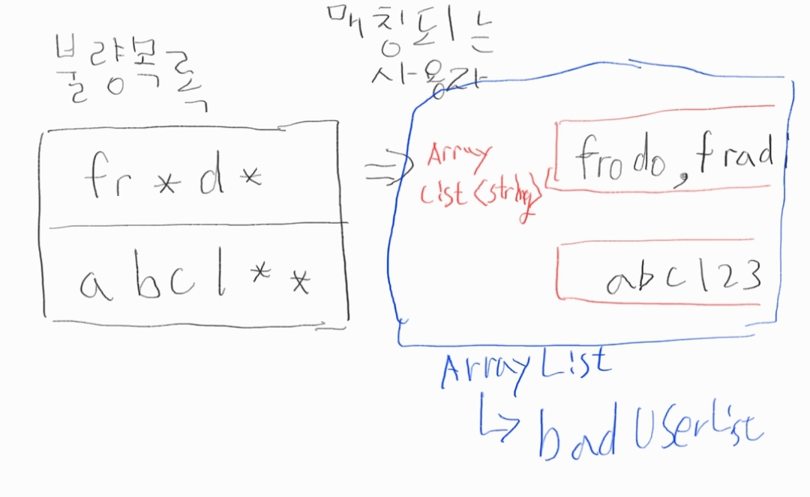
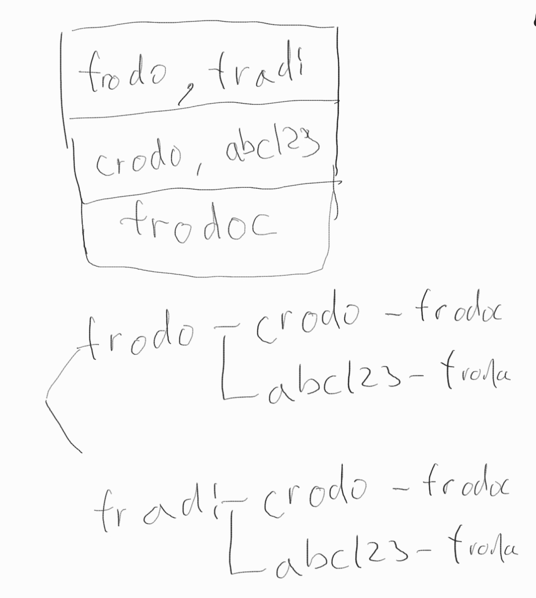

### 불량사용자 (dfs)_Lv3

##### 문제 : <https://programmers.co.kr/learn/courses/30/lessons/64064>

##### 설명 : 해당 문제는 dfs문제로서 아래와 같이 문제를 풀어나갔다.


1. 불량사용자를 찾아내는 메소드를 만든다.
  먼저 두 문자의 길이를 비교하고 아닐 경우 바로 불량사용자가 아닌것으로 간주한다.
  같을 경우 *을 제외하고 같은 자리의 문자가 같은지 확인해준다
  ```java
  //불량사용자 확인
	public boolean compareStr(String user, String banned) {
		
		boolean compare = true;
		
		//문자길이가 같은지 먼저 확인
		if(user.length()==banned.length()) {
			char userArray[]= user.toCharArray();
			char bannedArray[]=banned.toCharArray();
			
			for(int i=0; i<user.length(); i++) {
				
				//*이 아니면서 같은 위치에 문자가 다르면 false
				if(bannedArray[i]!='*' &&  userArray[i]!=bannedArray[i]) {
					compare=false;
					break;
				}
			}
		}else {
			compare=false;
		}
		
		return compare;
	}
  ```
  

2. 이중 포문을 사용하여  banned_id을 첫 포문으로 돌고 두번째 포문을 user_id 기준으로 돌아
   한 banned_id 당 매칭되는 user_id을 찾아서 Array<String>에 담고 이것을 다시 Array로 담았다=>badUserList 변수
   
   
   ``java
   for(String banned : banned_id) {
			ArrayList<String> equalId = new ArrayList<>();
			
			System.out.print("["+banned+"] : ");
			for(String user : user_id) {
				if(compareStr(user, banned)) {
					equalId.add(user);
					System.out.print(user+" ");
				}
					
			}
			badUserList.add(equalId);
			System.out.println();
		}
	``
   
   아래처럼 담긴다.<br>
   `
   [fr*d*] : frodo fradi <br>
   [abc1**] : abc123 
	`

3.예시로 매칭되는 user 아이디가 아래와 같이 되어있다면 깊이 탐색을 해야하기 때문에 dfs로 풀어야한다는것을 알 수 있다.<br>


4.dfs 다음 깊이로 들어갈때는 문자에 띄어쓰기를 하여 구분을 해주어 이전 경로도 기억할 수 있도록 하였다 
 <br>ex> 3번의 예시를 보면 첫 경로에는 "frodo crodo frodoc" 두번째 경로는 "frodo abc123 frodoc"
   `dfs(strList+" "+str, num+1);`


5. 띄어쓰기를 기준으로 담아져있기에 dfs 처음 실행할때는 띄어쓰기 기준으로 spilt하여 경로가 중복되지 않게 해준다<br>
   `if(!Arrays.asList(strListArr).contains(str))`
   
6. 스플릿하여 배열에 담은 값을 sort처리하여 
    깊이만큼 탐색하였을때 똑같은 불량사용자 목록이 있는지 체크를 하고 똑같은 불량사용자가 없다면
	result라는 리스트에 담아준다.
	`
	if(!result.contains(addStr.toString())) {
				result.add(addStr.toString());
	}
	`
   
###### 전체코드 

```java
import java.util.ArrayList;
import java.util.Arrays;

class Solution {
   ArrayList<ArrayList<String>> badUserList = new ArrayList<ArrayList<String>>();
	ArrayList<String> result = new ArrayList<String>();
	
	public int solution(String[] user_id, String[] banned_id) {
        
		for(String banned : banned_id) {
			ArrayList<String> equalId = new ArrayList<>();
			
			System.out.print("["+banned+"] : ");
			for(String user : user_id) {
				if(compareStr(user, banned)) {
					equalId.add(user);
					System.out.print(user+" ");
				}
					
			}
			badUserList.add(equalId);
			System.out.println();
		}
		
		System.out.println("==============================================");
		
		//dfs시작
		dfs("",0);
		
        return result.size();
    }
	
	
	//불량사용자 확인
	public boolean compareStr(String user, String banned) {
		
		boolean compare = true;
		
		//문자길이가 같은지 먼저 확인
		if(user.length()==banned.length()) {
			char userArray[]= user.toCharArray();
			char bannedArray[]=banned.toCharArray();
			
			for(int i=0; i<user.length(); i++) {
				
				//*이 아니면서 같은 위치에 문자가 다르면 false
				if(bannedArray[i]!='*' &&  userArray[i]!=bannedArray[i]) {
					compare=false;
					break;
				}
			}
		}else {
			compare=false;
		}
		
		return compare;
	}
	
	//strList : 불량사용자 저장하는 변수 /  num : dfs 깊이(badUserList size 만큼만 탐색)
	public void dfs(String strList, int num) {
		String strListArr[] = strList.split(" ");
		Arrays.sort(strListArr);//같은 경우의 목록을 비교하기위해 목록을 sort
		
		//깊이만큼 탐색했으면 result에 담아줌(불량회원목록)
		if(num<badUserList.size()) {
			
			for(String str : badUserList.get(num)) {
				
				//담겨져있는 불량회원이 중복되는지 확인
				if(!Arrays.asList(strListArr).contains(str)) {
					dfs(strList+" "+str, num+1);
				}
			}
			
		}else {
			StringBuffer addStr = new StringBuffer();
			
			for(String str: strListArr) {
				addStr.append(str);
			}
			
			if(!result.contains(addStr.toString())) {
				result.add(addStr.toString());
			}
		}
		
	}
}
```